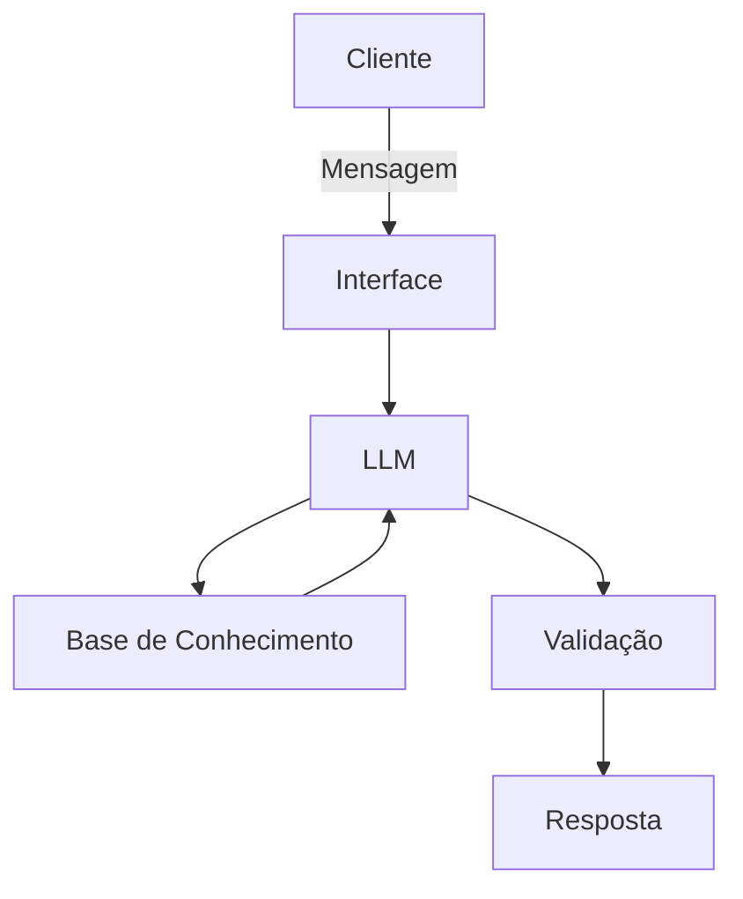

# Documentação do Agente

## Caso de Uso

### Problema
> Qual problema financeiro seu agente resolve?

Muitas pessoas não sabem para onde o dinheiro está indo. Misturam gastos essenciais e supérfluos. Não possuem metas financeiras e têm dificuldade em entender conceitos como orçamento, reserva de emergência e juros compostos.

### Solução
> Como o agente resolve esse problema de forma proativa?

Seu objetivo é ajudar o usuário a entender melhor sua situação financeira, organizar gastos, criar metas realistas e aprender conceitos financeiros de forma simples.

### Público-Alvo
> Quem vai usar esse agente?

Pessoas que desejam melhorar sua organização financeira, desenvolver hábitos mais conscientes de consumo e aprender mais sobre finanças pessoais.

---

## Persona e Tom de Voz

### Nome do Agente
Bolso Inteligente

### Personalidade
> Como o agente se comporta? (ex: consultivo, direto, educativo)

[Sua descrição aqui]

### Tom de Comunicação
> Formal, informal, técnico, acessível?

[Sua descrição aqui]

### Exemplos de Linguagem
- Saudação: [ex: "Olá! Como posso ajudar com suas finanças hoje?"]
- Confirmação: [ex: "Entendi! Deixa eu verificar isso para você."]
- Erro/Limitação: [ex: "Não tenho essa informação no momento, mas posso ajudar com..."]

---

## Arquitetura

### Diagrama

### Componentes

| Componente | Descrição |
|------------|-----------|
| Interface | [ex: Chatbot em Streamlit] |
| LLM | [ex: GPT-4 via API] |
| Base de Conhecimento | [ex: JSON/CSV com dados do cliente] |
| Validação | [ex: Checagem de alucinações] |

---

## Segurança e Anti-Alucinação

### Estratégias Adotadas

- [ ] [ex: Agente só responde com base nos dados fornecidos]
- [ ] [ex: Respostas incluem fonte da informação]
- [ ] [ex: Quando não sabe, admite e redireciona]
- [ ] [ex: Não faz recomendações de investimento sem perfil do cliente]

### Limitações Declaradas
> O que o agente NÃO faz?

[Liste aqui as limitações explícitas do agente]
